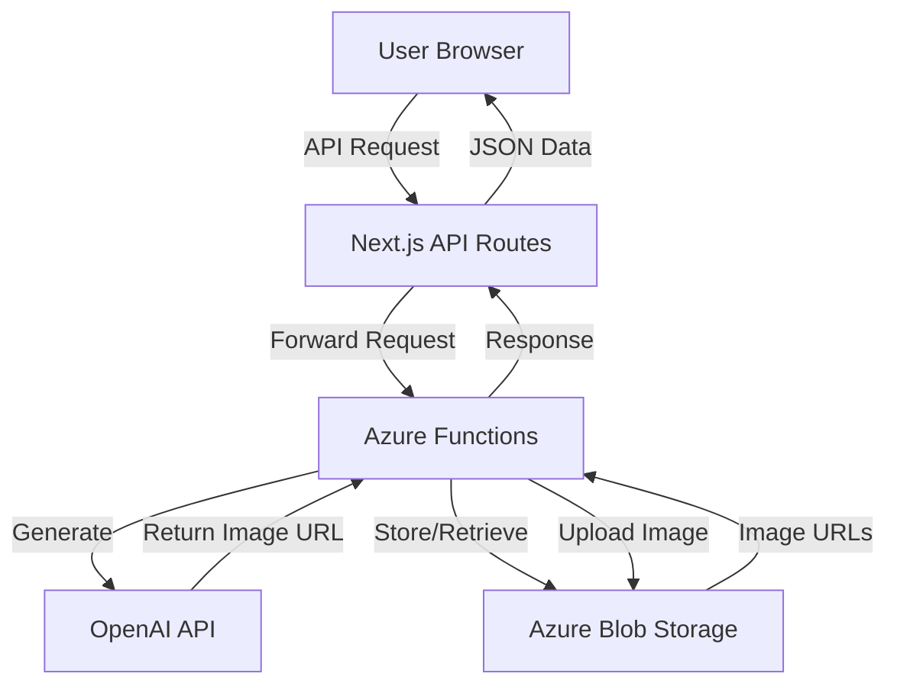

VisionaryAI's backend infrastructure is built entirely on Microsoft Azure, leveraging serverless functions for compute and blob storage for persistent image storage. This architecture provides scalability, reliability, and cost-efficiency.

## Architecture overview

The application uses a serverless architecture with clear separation of concerns:

<Steps>
  <Step title="Next.js frontend">
    User-facing web application built with Next.js 13, hosted separately from backend services.
  </Step>
  
  <Step title="Azure Functions">
    Four serverless functions handle all backend operations: image generation, suggestion generation, image retrieval, and SAS token generation.
  </Step>
  
  <Step title="OpenAI API">
    Azure Functions communicate directly with OpenAI's API for DALL-E 3 and GPT-3.5 Turbo.
  </Step>
  
  <Step title="Azure Blob Storage">
    Generated images are stored persistently in a blob container named "images".
  </Step>
</Steps>



<Info>
This architecture ensures that expensive compute operations (AI generation) scale automatically based on demand without maintaining dedicated servers.
</Info>

## Azure Functions

VisionaryAI uses four Azure Functions, each handling a specific responsibility:

### Generate image function

Handles the complete image generation workflow:

```javascript azure/src/functions/generateImage.js
app.http("generateImage", {
    methods: ["POST"],
    authLevel: "anonymous",
    handler: async (request) => {
        const { prompt } = await request.json();
        
        // Generate with DALL-E 3
        const response = await openai.createImage({
            model: "dall-e-3",
            prompt: prompt,
            n: 1,
            size: '1024x1024',
        })
        image_url = response.data.data[0].url;
        
        // Download the generated image
        const res = await axios.get(image_url, { responseType: 'arraybuffer' });
        const arrayBuffer = res.data;
        
        // Upload to Azure Blob Storage
        const timestamp = new Date().getTime();
        const file_name = `${prompt}_${timestamp}.png`;
        const blockBlobClient = containerClient.getBlockBlobClient(file_name);
        await blockBlobClient.uploadData(arrayBuffer)
        
        return { body: "Image uploaded successfully" }
    },
})
```

<Accordion title="Why download and re-upload?">
DALL-E 3 provides temporary URLs that expire after a short time. Downloading and uploading to Azure Blob Storage ensures permanent access to generated images.
</Accordion>

<Accordion title="ArrayBuffer usage">
The image is downloaded as an `arraybuffer` (binary data) to preserve image quality during the transfer to Azure Blob Storage.
</Accordion>

### Get images function

Retrieves all stored images with secure access tokens:

```javascript azure/src/functions/getImages.js
app.http("getImages", {
    methods: ["GET"],
    authLevel: "anonymous",
    handler: async (request, context) => {
        const containerClient = blobServiceClient.getContainerClient(containerName);
        
        const imageUrls = [];
        const sasToken = await generateSASToken();
        
        for await (const blob of containerClient.listBlobsFlat()) {
            const imageUrl = `${blob.name}?${sasToken}`;
            const url = `https://${accountName}.blob.core.windows.net/${containerName}/${imageUrl}`
            imageUrls.push({ url, name: blob.name });
        }
        
        const sortedImageUrls = imageUrls.sort((a, b) => {
            const aName = a.name.split("_").pop().toString().split(".").shift();
            const bName = b.name.split("_").pop().toString().split(".").shift();
            return bName - aName; 
        })
        
        return{
            jsonBody:{
                imageUrls: sortedImageUrls
            }
        }
    }
})
```

<Note>
This function lists all blobs in the container, appends SAS tokens for secure access, and sorts by timestamp for chronological display.
</Note>

### Get ChatGPT suggestion function

Generates creative prompt suggestions using GPT-3.5:

```javascript azure/src/functions/getChatGPTSuggestion.js
app.http('getChatGPTSuggestion', {
    methods: ['GET'],
    authLevel: 'anonymous',
    handler: async (request, context) => {
        const response = await openai.createCompletion({
            model: 'gpt-3.5-turbo-instruct',
            prompt: 'Write a random text prompt for DALL.E to generate an image, this prompt will be shown to the user, include details such as the genre and what type of painting it should be, options can include: oil painting, watercolor, photo-realistic, 4K, abstract, modern, black and white etc. Do not wrap the answer in quotes',
            max_tokens: 100,
            temperature: 0.9,
        })
        const responseText = response.data.choices[0].text;
        
        return { body: responseText };
    }
});
```

<Tip>
The high temperature (0.9) ensures varied, creative suggestions rather than repetitive responses.
</Tip>

### Generate SAS token function

Creates time-limited access tokens for secure image retrieval:

```javascript azure/lib/generateSASToken.js
const { BlobServiceClient, BlobSASPermissions, generateBlobSASQueryParameters, StorageSharedKeyCredential } = require('@azure/storage-blob');

module.exports = async function generateSASToken() {
    const sharedKeyCredential = new StorageSharedKeyCredential(
        accountName,
        accountKey
    );
    
    const sasOptions = {
        containerName,
        permissions: BlobSASPermissions.parse('r'), // Read-only
        startsOn: new Date(),
        expiresOn: new Date(new Date().valueOf() + 86400000), // 24 hours
    };
    
    const sasToken = generateBlobSASQueryParameters(
        sasOptions,
        sharedKeyCredential
    ).toString();
    
    return sasToken;
};
```

<Warning>
SAS tokens provide read-only access and expire after 24 hours, ensuring secure but convenient image access.
</Warning>

## Azure Blob Storage

Images are stored in Azure Blob Storage for reliable, scalable persistence:

### Storage container

- **Container name**: `images`
- **Access level**: Private (requires SAS token)
- **Storage tier**: Hot (optimized for frequent access)

### Blob naming convention

All images follow a consistent naming pattern:

```
{prompt}_{timestamp}.png
```

**Example**:
```
oil painting of a sunset over mountains_1710432000000.png
```

<Accordion title="Benefits of this format">
- **Searchable**: Prompts are visible in filenames
- **Sortable**: Unix timestamps enable chronological ordering
- **Unique**: Timestamp ensures no filename collisions
- **Parseable**: Easy to extract prompt and creation time
</Accordion>

### Storage operations

#### Upload operation

```javascript
const blockBlobClient = containerClient.getBlockBlobClient(file_name);
await blockBlobClient.uploadData(arrayBuffer)
```

- Uses block blob type (optimized for large files)
- Direct upload from memory (arraybuffer)
- Automatic content type detection

#### List operation

```javascript
for await (const blob of containerClient.listBlobsFlat()) {
    // Process each blob
}
```

- Lists all blobs in flat structure (no virtual folders)
- Async iteration for memory efficiency
- Returns metadata including name and properties

<Info>
The `listBlobsFlat()` method is efficient even with thousands of images, as it uses pagination internally.
</Info>

## Security model

VisionaryAI implements multiple security layers:

### Environment variables

Sensitive credentials are stored as environment variables:

```javascript
const accountName = process.env.accountName;
const accountKey = process.env.accountKey;
const openaiApiKey = process.env.OPENAI_API_KEY;
```

<Warning>
Never commit `.env` files or hardcode credentials in source code. Always use environment variables for production deployments.
</Warning>

### SAS tokens

Shared Access Signatures provide:

- **Time-limited access**: 24-hour expiration
- **Permission scoping**: Read-only access
- **No credential exposure**: Account keys stay on server

```javascript
const sasOptions = {
    containerName,
    permissions: BlobSASPermissions.parse('r'), // Read-only
    startsOn: new Date(),
    expiresOn: new Date(new Date().valueOf() + 86400000),
};
```

### Authentication levels

All Azure Functions use:

```javascript
authLevel: "anonymous"
```

<Note>
While functions are anonymous (no auth header required), they should be behind a Next.js API layer in production to implement rate limiting and access control.
</Note>

## Deployment configuration

Azure Functions require specific configuration files:

### host.json

Defines global function app settings:

```json
{
  "version": "2.0",
  "logging": {
    "applicationInsights": {
      "samplingSettings": {
        "isEnabled": true,
        "maxTelemetryItemsPerSecond": 20
      }
    }
  },
  "extensionBundle": {
    "id": "Microsoft.Azure.Functions.ExtensionBundle",
    "version": "[4.*, 5.0.0)"
  }
}
```

### package.json

Specifies Azure Functions dependencies:

```json
{
  "dependencies": {
    "@azure/functions": "^4.0.0",
    "@azure/storage-blob": "^12.17.0",
    "openai": "^3.2.1",
    "axios": "^1.6.0"
  }
}
```

## Scaling and performance

Azure's serverless platform provides automatic scaling:

### Cold starts

- **First request**: 2-5 seconds for function initialization
- **Subsequent requests**: Less than 100ms response time
- **Keep-warm strategies**: Use monitoring to ping functions

### Concurrent executions

- Azure automatically scales function instances based on load
- Each instance can handle multiple requests
- No configuration needed for basic scaling

<Tip>
For production applications with consistent traffic, consider using Azure Functions Premium Plan to eliminate cold starts.
</Tip>

### Rate limiting

OpenAI API rate limits apply:

- **DALL-E 3**: Varies by account tier
- **GPT-3.5 Turbo**: Typically 3,500 requests/minute

<Warning>
Implement client-side rate limiting or request queuing to prevent exceeding OpenAI's rate limits during high traffic.
</Warning>

## Cost optimization

VisionaryAI's Azure architecture is designed for cost efficiency:

### Consumption plan pricing

- **Execution time**: Charged per million executions
- **Compute time**: Charged per GB-second
- **Free tier**: 1 million executions + 400,000 GB-seconds/month

### Blob storage costs

- **Storage**: ~$0.018/GB/month (hot tier)
- **Operations**: Minimal cost for writes and reads
- **Bandwidth**: Free egress to Azure Functions

### OpenAI API costs

- **DALL-E 3**: $0.040 per image (standard quality, 1024x1024)
- **GPT-3.5 Turbo**: ~$0.0015 per suggestion

<Info>
For a typical user generating 10 images and 20 suggestions per day, monthly costs would be approximately:
- OpenAI: $12.90 (300 images + 600 suggestions)
- Azure Functions: Less than $1 (within free tier)
- Blob Storage: Less than $1 (assuming ~50GB)
</Info>

## Local development

To run Azure Functions locally:

<Steps>
  <Step title="Install Azure Functions Core Tools">
    ```bash
    npm install -g azure-functions-core-tools@4
    ```
  </Step>
  
  <Step title="Navigate to Azure directory">
    ```bash
    cd azure
    ```
  </Step>
  
  <Step title="Install dependencies">
    ```bash
    npm install
    ```
  </Step>
  
  <Step title="Configure environment">
    Create a `local.settings.json` file:
    ```json
    {
      "IsEncrypted": false,
      "Values": {
        "FUNCTIONS_WORKER_RUNTIME": "node",
        "OPENAI_API_KEY": "your-key-here",
        "accountName": "your-storage-account",
        "accountKey": "your-storage-key"
      }
    }
    ```
  </Step>
  
  <Step title="Start function host">
    ```bash
    npm run start
    ```
    Functions available at `http://localhost:7071/api/`
  </Step>
</Steps>

<Warning>
The `local.settings.json` file should be in `.gitignore` to prevent committing credentials.
</Warning>

## Monitoring and debugging

Azure provides built-in monitoring capabilities:

### Application Insights

- Automatic telemetry collection
- Request/response logging
- Performance metrics
- Error tracking

### Console logging

```javascript
console.log(`PROMPT=> ${prompt}`);
console.log("Image uploaded to Azure Blob Storage")
console.log(" Error uploading image ", error.message)
```

Logs appear in:
- Azure Portal (Function Monitor)
- Application Insights (Logs)
- Local terminal (during development)

<Tip>
Use structured logging with consistent prefixes (like `PROMPT=>`) to make logs easier to search and filter in Application Insights.
</Tip>

## Next steps

<CardGroup cols={2}>
  <Card title="Image generation" icon="wand-magic-sparkles" href="/features/image-generation">
    Learn how the generation process uses Azure Functions
  </Card>
  <Card title="Image gallery" icon="images" href="/features/image-gallery">
    Understand how images are retrieved from Blob Storage
  </Card>
</CardGroup>